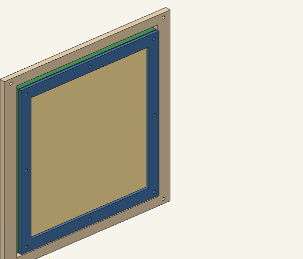
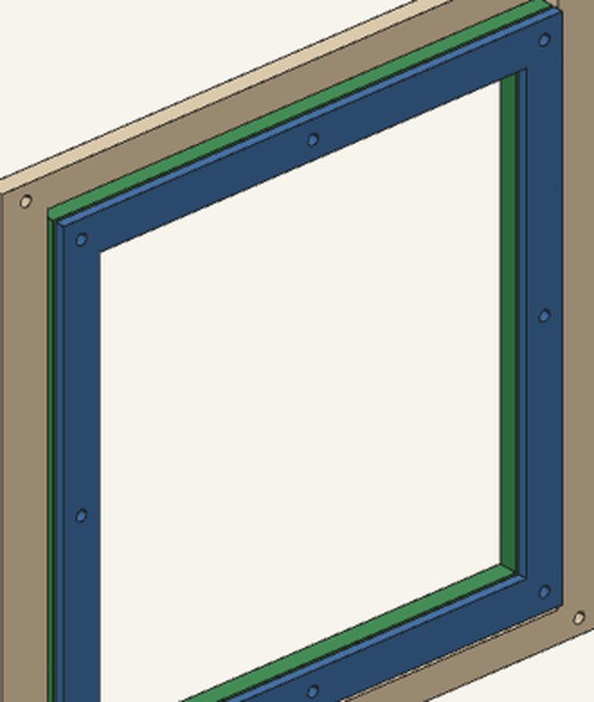

# Butterfly habitat

Printable observation box for kids. About 200 mm on a side. Fits a 256 mm bed.

The listing photo was a style reference, not a measurement. Do not scale this to that box.

## What you print

PETG. 0.4 mm nozzle. 0.2 mm layers. Flat on the bed. No supports.

- `habitat-base` ×1 — solid floor, drain slots
- `habitat-top` ×1 — roof frame, 12 mm border, no shelf, no cable hole
- `habitat-back` ×1 — full 200 mm frame
- `habitat-left`, `habitat-right` ×1 each — 188 mm, stop at the back inside face
- `habitat-front` ×1 — door opening and loose slide lips
- `habitat-door-frame` ×1 — sliding carrier
- `habitat-clamp-wall` ×1 — second plate, screws to the back frame
- `habitat-clamp-side` ×2 — second plate, screws to the side frames
- `habitat-clamp-door` ×1 — second plate, screws to the door frame
- `habitat-clamp-roof` ×1 — second plate, screws to the roof

STLs are in `stl/`. Editable source is `src/butterfly-habitat.py`. Contract is `docs/PRINT_SPEC.yaml`.

## Mesh

Do not print the screen. A 0.4 mm nozzle cannot make a hole smaller than a newly hatched caterpillar. A monarch first instar is about 0.5–1.5 mm wide at the body. Buy a sheet. No-see-um or organza still works. Woven wire works only if the listing opening is 0.4 mm or smaller. A photo is not that number. Do not use 1/8 in hardware cloth.

For cloth, cut a sheet bigger than the window and smaller than the outer edge. Lay it on the frame. Screw the clamp plate on top. The screws pierce the fabric. That is the cloth joint.

The inspector draws that cloth cut as a 0.3 mm sheet in the 1 mm gap. The thickness is a stand-in, not a measured fabric, and it is not an STL. It covers the window and the screw holes, and it stops inside the outer edge. The roof sheet covers the old photo corner. Wire is not drawn.

For wire, do not pierce the sheet. Cut it larger than the window and smaller than the screw circle. Tuck the raw edge under the clamp. Screws stay plastic-to-plastic.

## Screws

M3 clearance holes are 3.6 mm (ISO 273 coarse). Use M3 bolts and nylock nuts. This is not a snap fit and it is not a tested press.

The door lifts out the open top. Two millimetres of clearance per side, on purpose.

## Door

The door is not screwed to the front. The four holes in the front corners do not enter the floor, the sides, or the roof. A screw through one of them comes out the inside face into empty air. The eight holes in the door match the door clamp only. The front itself only touches the floor, the sides, and the roof. It does not snap, and nothing screws it on. The side walls are 188 mm. They stop at the inside face of the back. They do not run through it.

The green frame sits in the opening. The tan sheet is the cloth cut, in the 1 mm gap. The blue plate is the clamp. Those two share a hole pattern. The cream front does not. The screws would pierce the sheet.

This is a seated view of the mill parts. It is not a print approval. The assembly view seats the door the same way.

The side lips are on the inside face. They overlap the door border from 17 mm to 19 mm in X. The door sits in the 6 mm plate. The lip starts about 0.4 mm past the inner face, so the solids do not intersect. In this stand the cross lip is at the top of the opening, not under the door.

## Camera

The roof is Plate A. There is no shelf and no cable hole. The XIAO ESP32-S3 Sense is not cut on this plate. The official expansion-board DXF has no lens circle, so Plate B stays a drawing. Do not cut a lens hole from this file.

## License

MIT. See `LICENSE`.
