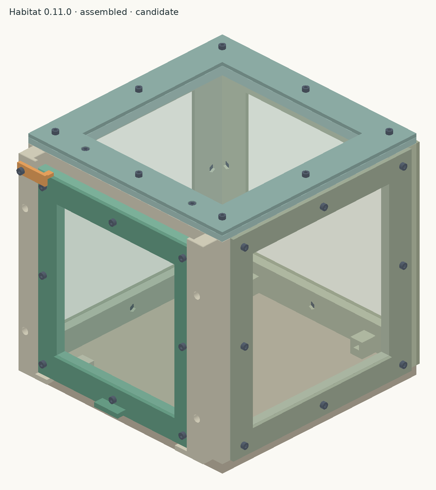
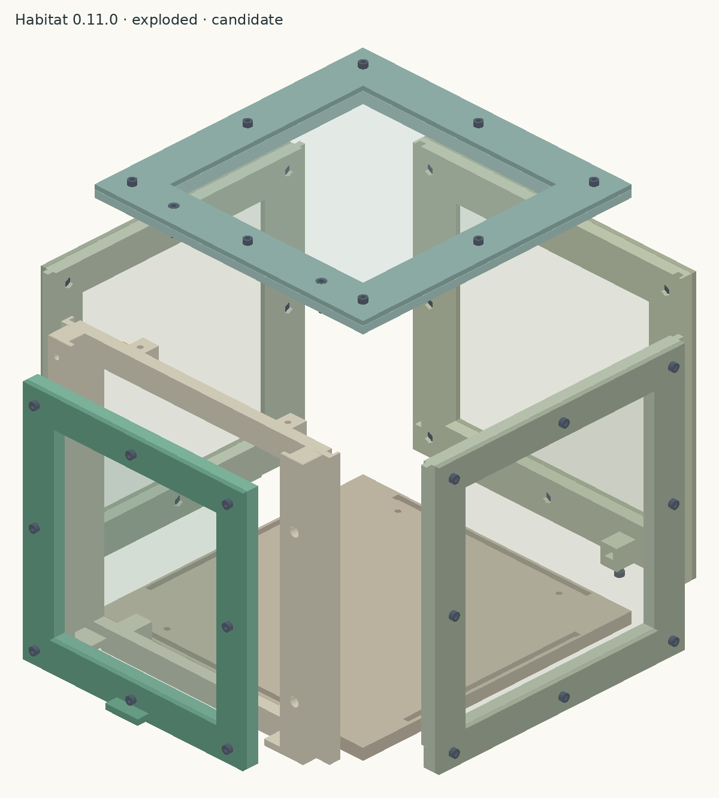
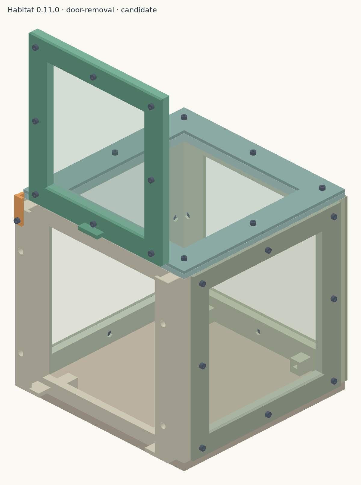
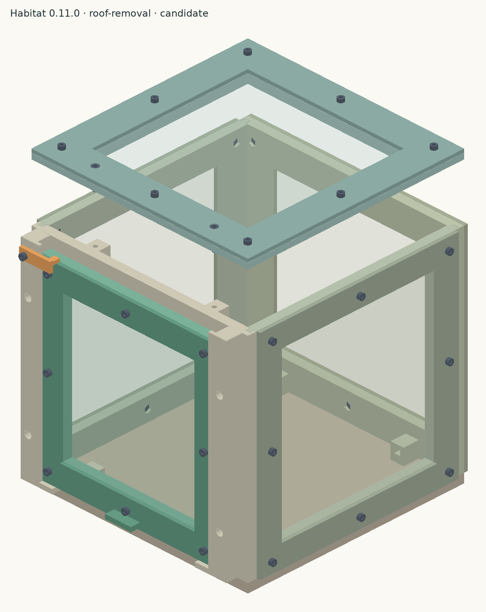

# Butterfly habitat

A roughly 200 mm enclosure with a washable floor, drop-in walls, an external
sliding mesh door, and a removable mesh roof. PETG; indoor or sheltered use.

**Revision 0.11 is an engineering candidate.** Fabric thickness is provisionally
0.20 mm. Measure your compressed fabric before final release. Geometry and slicing checks pass with the documented wall supports. Physical fit,
mesh retention, and 50 door cycles remain untested. No support-free claim is made.



## Start with a small mesh test

Print one of each in PETG:

1. [Mesh-fastener frame coupon](candidate/coupons/mesh-fastener-back.stl).
2. [Matching clamp coupon](candidate/coupons/mesh-fastener-back-clamp.stl).

Import them as **separate objects** in Bambu Studio and keep their supplied
orientations. Test with your actual mesh, M3 × 10 socket-head screws and M3
nyloc nuts. Check nut fit, full engagement through the nylon locking section,
recessed screw tips and firm fabric retention without cracking the clamp.

If that passes, print the [door](candidate/stl/habitat-door.stl) and
[door clamp](candidate/stl/habitat-door-clamp.stl). This tests a complete mesh
border using eight screws and eight nuts, and can become the finished door.
Then test the [rail and corner coupons](candidate/coupons/) before printing the
large panels. The full door-cycle test also needs the front frame, both rails
and keeper. The mesh-fastener coupon prints were reported successful. Mesh was not yet
available for the test; fabric retention, assembled thickness and full hardware
engagement remain unverified.

## P1S print setup

| Setting | Candidate configuration |
| --- | --- |
| Printer / nozzle | Bambu Lab P1S / 0.4 mm |
| Material | PETG; current slices use Generic PETG |
| Build plate | Textured PEI |
| Layer height | 0.20 mm |
| Walls / infill | 4 walls / 20% |
| Brim | 5 mm outer brim |
| Supports | Build-plate-only normal supports on front, back, left and right |
| Orientation | Already applied to STLs; keep it when importing |

Match the slicer’s filament and plate selections to what is actually installed.
The 15 production parts need multiple plates. The existing
[sliced projects](candidate/slicing/) document the candidate settings; inspect
your arranged plate and slice preview before sending a job to the printer.
See the [print specification](docs/PRINT_SPEC.yaml) for part-by-part orientation.

## Color plan

The local inspector previews four filament colors. Screen colors are approximate.

| Color | Parts |
| --- | --- |
| Medium blue | Base, front, back, left, right, roof |
| Matte pink | Back/side/roof clamps and both rails |
| Orange | Door and door clamp |
| Red | Rotating keeper / latch |

These are separate printed parts, so the scheme does not require color changes
within a part. The static reference images below retain the earlier neutral
palette. The inspector palette is defined in `inspector/colors.json`.

The manufacturing baseline remains PETG. If using matte PLA instead, select
its matching filament profile and repeat the fit tests with that material.

### PLA prints while waiting for mesh

The builder selected PLA for the current spools. The
[PLA starter pack](candidate/print-first/README.md) contains prepared P1S projects
for the blue corner-fit coupons, then the actual blue base, blue front and red
keeper. Start with the corner fit; the base is the first full-size print.
These use Generic PLA until a spool-specific profile is selected. The original
`candidate/slicing/` projects remain PETG. Mesh-dependent parts and physical
release checks remain pending.

## Selected mesh candidate

[uxcell 150-micron nylon mesh, 39 × 39 inches](https://www.amazon.com/dp/B09VC3K6C2)
is the selected candidate. One sheet is sufficient for the five panel cutouts.
The 150-micron rating describes the openings, **not the fabric thickness**.
Measure its compressed thickness and test retention with the coupons before
finalizing the mesh-dependent parts. No measured thickness or mesh-fit result
has been recorded yet. The current CAD still assumes 0.20 mm.

For use with monarch eggs and hatchlings, fine mesh alone is insufficient:
door and wall gaps also need checking before the enclosure is used.

## Assembly at a glance

### Built-in part IDs for future prints

The separate [labeled print set](candidate/labeled/README.md) has recessed IDs modeled
into all 15 parts. The existing Bambu projects and unmarked candidate files
remain the current build's print set. There is no need to reprint existing
pieces just for a label; use the [ID key](docs/ASSEMBLY.md#part-id-key) and
[paper labels](candidate/templates/part-labels.svg) to identify them.

| Assembly | IDs |
| --- | --- |
| Base | A1 |
| Front, left rail, right rail, keeper | B1, B2, B3, B4 |
| Back frame and clamp | C1 + C2 |
| Left frame and clamp | D1 + D2 |
| Right frame and clamp | E1 + E2 |
| Door frame and clamp | F1 + F2 |
| Roof frame and clamp | G1 + G2 |

Letters identify assemblies; matching frame/clamp pairs use `1` and `2`.
Left and right are viewed from outside the front doorway. The written guide,
inspector booklet and paper labels use the same IDs.

The marks are 0.4 mm deep with 0.8 mm strokes. Their locations retain at least
1.6 mm of backing and keep the original envelopes and print orientations.
CAD checks cover the labeled solids and interfaces; physical label legibility
and fit remain untested. The [variant manifest](candidate/labeled/assembly/manifest.json)
records each label location and both source hashes. This is still the 0.11.0
engineering candidate, with the same unmeasured mesh assumption.



*Exploded reference view. Offsets show the parts; they are not installation paths.*

1. Clamp mesh to the back, left, right, door and roof frames on the bench.
2. Preload the remaining nuts in the front, back and left rail.
3. Attach the two rails and rotating keeper to the front frame.
4. Seat front and back in the base; secure with four screws from underneath.
5. Lower the side panels into the open wall joints and base grooves.
6. Slide the door down the outside tracks and check the keeper.
7. Seat the roof and install its two separate retention screws from above.
8. Check the fabric, hardware and joints; complete 50 door cycles.

The [illustrated assembly guide](docs/ASSEMBLY.md) gives the hardware counts,
nut directions and checks for each step. Cut mesh using the
[1:1 templates](candidate/templates/) and identify parts with the
[paper labels](candidate/templates/part-labels.svg).

| Hardware | Quantity |
| --- | ---: |
| Stainless M3 × 10 socket-head screw | 45 |
| Stainless M3 × 16 socket-head screw | 6 |
| M3 nyloc nut, 5.5 mm flats × 4 mm overall height | 51 |

Use a 2.5 mm hex driver. The five mesh rings each use eight short screws.
The remaining five short screws attach the rails and keeper. Four long screws
retain the base and two retain the roof. See the [hardware list](candidate/hardware.csv).

### Door and roof access

| Door lifts out with the roof installed | Roof lifts off as one assembly |
| --- | --- |
|  |  |

Swing the keeper clear before lifting the door; allow about 190 mm upward
travel. Remove only the roof’s **two long retention screws** to lift it off.
Its eight mesh screws stay assembled. Keep the walls upright while the roof is off.

## Files

- [Candidate STLs](candidate/stl/) — 15 printed parts, one of each file.
- [STEP parts](candidate/step/) and [complete assembly](candidate/assembly/habitat-assembly.step).
- [Assembly guide](docs/ASSEMBLY.md), [hardware list](candidate/hardware.csv), and [mesh templates](candidate/templates/).
- [Fit coupons](candidate/coupons/) — start here before a complete panel or habitat.
- [Print specification](docs/PRINT_SPEC.yaml) and [validation evidence](candidate/validation.json).
- [Sliced projects](candidate/slicing/) — inspection evidence; review before printing.

Old STLs, snap coupons, source and tests are under `archive/`. Do not mix
revisions. Historical planning notes and camera sketches describe earlier work.

## Local CAD inspector

From the repository root:

```sh
python3 -m http.server 8118 --bind 127.0.0.1 --directory inspector
```

Open [localhost:8118](http://127.0.0.1:8118/). The inspector contains all
122 components: 15 prints, five mesh sheets, 51 screws and 51 nuts.
Drag to orbit, scroll to zoom, click parts to inspect, or use the translucent,
exploded and section views.

The **Instructions** button generates a printable 12-step booklet inside the
inspector, with CAD illustrations, hardware counts and assembly directions.
It shows the five mesh subassemblies separately before the enclosure steps.
The header also links to the written guide.

To refresh the viewer after changing CAD, export its model with FreeCAD and
regenerate the instructions:

```sh
APPIMAGE_EXTRACT_AND_RUN=1 VibeCADCmd scripts/label-parts.py
APPIMAGE_EXTRACT_AND_RUN=1 VibeCADCmd scripts/export-inspector.py
python3 scripts/labels.py
python3 scripts/assembly-guide.py
```

Edit `scripts/assembly-guide.py` to update the shared sequence used by the
Markdown guide, browser guide and inspector booklet.
Edit `src/part_ids.py` for the shared ID map and engraving locations. The label
exporter writes `candidate/labeled/` and does not replace the original print
set. Re-slice the labeled geometry before printing; existing unmarked G-code
cannot acquire labels from a guide update.

## Build and check

The generator needs FreeCAD's Python modules (`FreeCAD`, `Part`, `MeshPart`).
On this workstation VibeCADCmd provides them. It does not set `__main__` when
loading a script, so use the entry point:

```sh
APPIMAGE_EXTRACT_AND_RUN=1 VibeCADCmd scripts/cad-entry.py
APPIMAGE_EXTRACT_AND_RUN=1 HABITAT_ACTION=export VibeCADCmd scripts/cad-entry.py
```

The first command checks in memory. It cannot overwrite STL or STEP files.
The second checks and exports the complete candidate set, manifest, hardware
list, cutting templates, coupons and inspection views. Direct module imports
also have no export side effects. The entry point returns nonzero on validation
failure. Require `geometry_pass: true` and a fresh manifest matching the source hash.

Set `HABITAT_MESH_MM` to your measured compressed thickness and
`HABITAT_MESH_MEASURED=1` only after measuring it. The supported stack range is
0.05–0.40 mm. A thicker material requires a fastening redesign.

```sh
python3 scripts/slice.py --profiles /path/to/BambuStudio/resources/profiles/BBL
python3 scripts/labels.py
python3 -m unittest discover -s tests
# Optional PNG inspection views; needs numpy and Pillow:
python3 scripts/render-views.py
```

To re-slice one part, add `--part habitat-base`. The results for the other parts
are retained. New slices run in a clean temporary directory, so an old project
cannot be mistaken for a successful new slice. Source, profile and project
hashes are recorded with each new result.

For PLA, choose a separate output directory to keep the PETG evidence intact:

```sh
python3 scripts/slice.py --profiles /path/to/BambuStudio/resources/profiles/BBL \
  --filament 'Generic PLA' --output candidate/slicing-pla --part habitat-base
```

An output directory cannot mix different printer/process/filament profiles.
Use a fresh directory when changing those settings. Keep the starter projects'
color assignments when preparing new PLA plates.

## Repository checks

These checks use Python 3.10+ and do not require FreeCAD, Bambu Studio or a
printer. The installer downloads a checksum-pinned Gitleaks release into the
ignored `.local/bin/` directory on Linux or macOS:

```sh
python3 scripts/install-gitleaks.py
python3 -m unittest discover -s tests -v
python3 scripts/package-starter.py --check
python3 scripts/check-secrets.py --history
```

The [GitHub Actions workflow](.github/workflows/checks.yml) runs the same checks
on pushes and pull requests with read-only permissions. It checks exported CAD
evidence and meshes, slicer failure handling, PLA project settings, source
hashes, ZIP contents, and secret detection inside current, staged and historical
print archives. It does not substitute for FreeCAD regeneration or physical
fit tests. Secret handling rules are in [AGENTS.md](AGENTS.md).

To rebuild the PLA download ZIP after an approved project or guide update, run
`python3 scripts/package-starter.py`. It validates the projects first and creates
a repeatable archive containing only the listed files. `--check` verifies the
existing ZIP and loose STL copies without modifying them.

## Validation status

Geometry checks cover all 7,381 assembly pairs, fastener alignment, intended
contacts, door/roof motion and installation access. The 15 production parts
have sliced successfully using the documented P1S PETG settings.

Fabric thickness is still an **unmeasured 0.20 mm assumption**. Coupon fit,
full-panel mesh retention and the 50-cycle door test remain pending. This is
an engineering candidate, not a fit-verified release.
[Verification and release](docs/VERIFICATION.md) describes the checks,
limitations and evidence needed for release.

MIT. See [LICENSE](LICENSE).
